# WeWe RSS 用户使用文档

本文档面向日常使用者，包含两部分：

- 服务端后台使用
- 浏览器正文采集插件使用

## 一、服务端后台使用

### 1. 登录系统
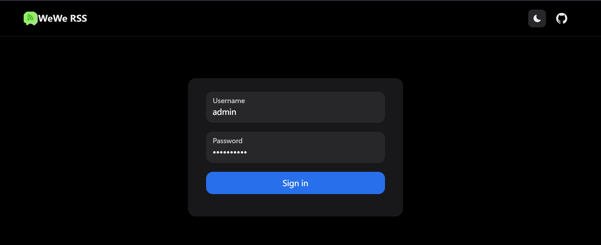
访问地址：

```text
http://your-server:4000/
```

打开后会进入登录页。输入分配给你的账号和密码后登录。

登录后可以使用：

- 公众号源
- 知识问答
- 索引配置
- 账号管理

如果浏览器清理了 cookie，需要重新登录。重新登录不会影响已经保存的公众号、知识库和历史对话。

### 2. 账号管理
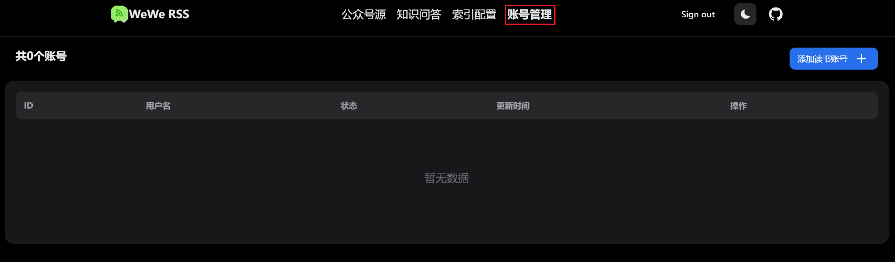
“账号管理”用于绑定微信读书账号。系统需要通过微信读书账号获取公众号文章。

使用流程：

1. 进入“账号管理”。
2. 点击添加读书账号。
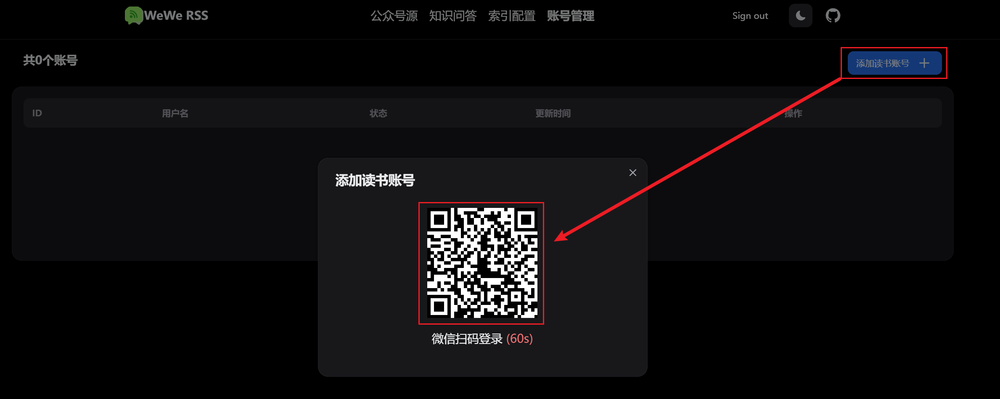
3. 按页面提示完成微信读书登录。
4. 登录成功后，该账号会出现在账号列表中。

注意事项：

- 如果账号显示失效，需要重新登录。
- 如果账号请求过于频繁，可能会短时间不可用，稍后再试。
- 不要频繁重复登录或刷新同一个账号。

### 3. 公众号源

“公众号源”用于添加和管理你要订阅的公众号。
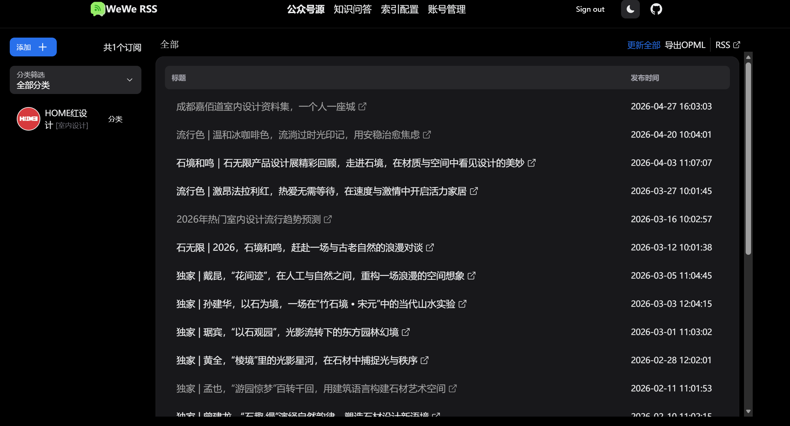
添加公众号：

1. 打开微信公众号文章。
2. 复制文章分享链接。
3. 回到系统的“公众号源”页面。
4. 粘贴链接并添加。
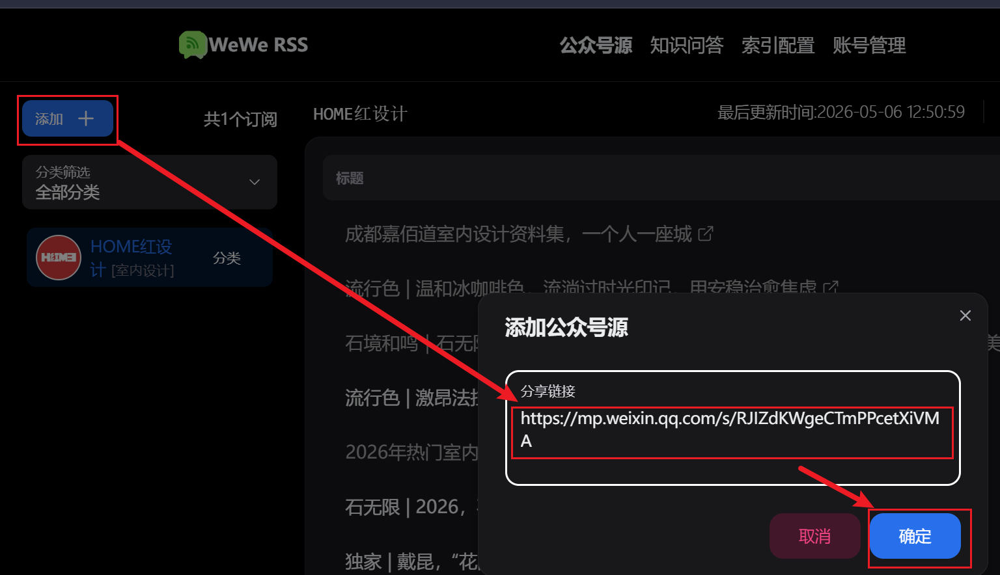
5. 添加成功后，可以刷新文章或获取历史文章。注意，刷新文章默认只获取前50篇
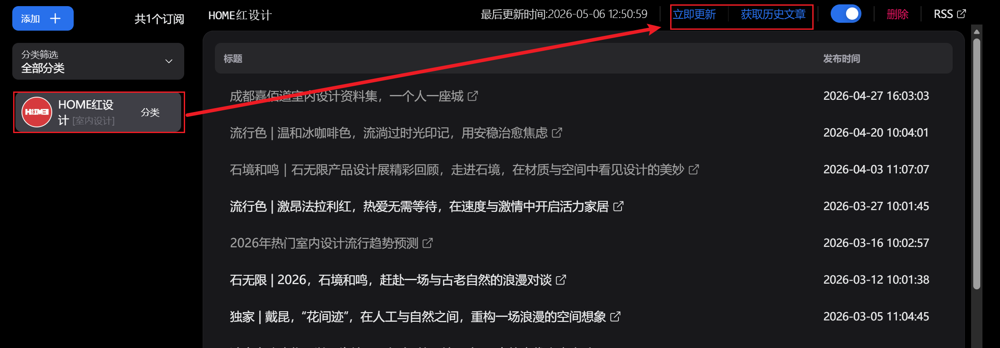


常用操作：

- 刷新文章：获取公众号最新文章。
- 获取历史文章：获取公众号更早的文章。
- 修改分类：给公众号设置分类，方便后续筛选和知识问答。
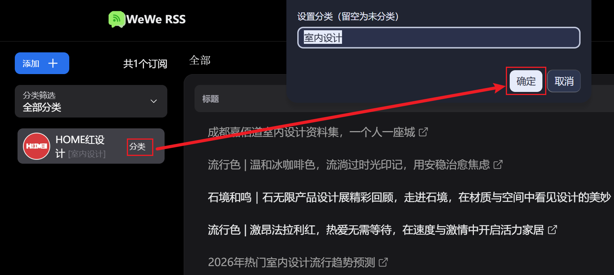
- 筛选分类：只显示特定分类的公众号源
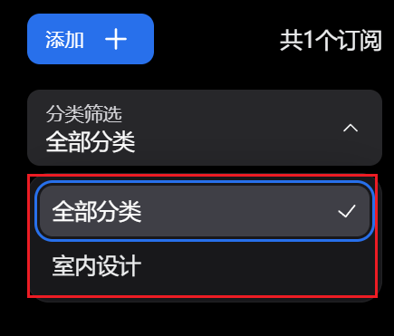
- 删除公众号源：从你的列表中移除该公众号。
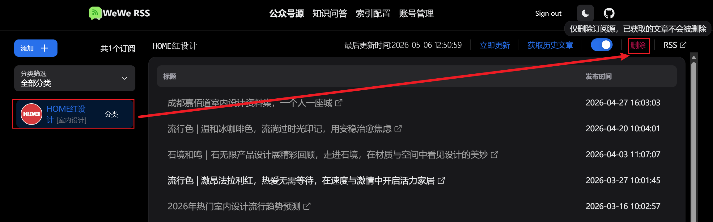

分类建议：

- 按行业分，例如“家居”“游戏”“财经”。
- 按客户或项目分，例如“客户A”“竞品观察”。
- 分类名称尽量保持统一，避免同一类内容出现多个相近名称。

### 4. 索引配置
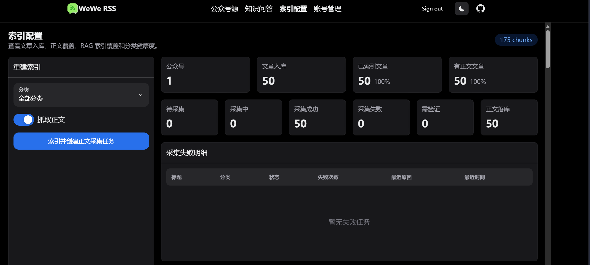
“索引配置”用于把文章加入知识库，并为缺少正文的文章创建采集任务。

页面中常见指标：

- 公众号：当前可用公众号数量。
- 文章入库：系统已经获取到的文章数量。
- 已索引文章：已经进入知识库检索范围的文章数量。
- 有正文文章：已经采集到正文的文章数量。
- 待采集：等待浏览器插件采集正文的任务数量。
- 采集中：正在被插件处理的任务数量。
- 采集成功：已经成功采集正文的任务数量。
- 采集失败：采集失败的任务数量。
- 需验证：遇到微信验证，需要人工处理的任务数量。

推荐使用流程：

1. 先在“公众号源”中添加公众号并刷新文章。
2. 进入“索引配置”。
3. 选择要处理的分类，或保留全部分类。
4. 点击“索引并创建正文采集任务”。
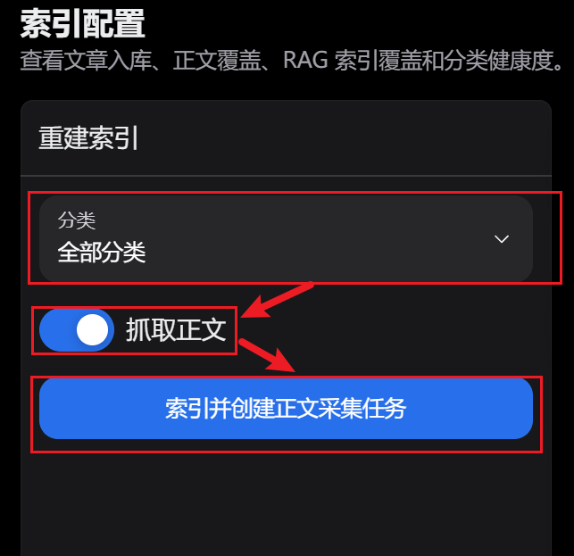
5. 打开浏览器正文采集插件（见下方正文采集插件使用版块），让插件自动采集正文。
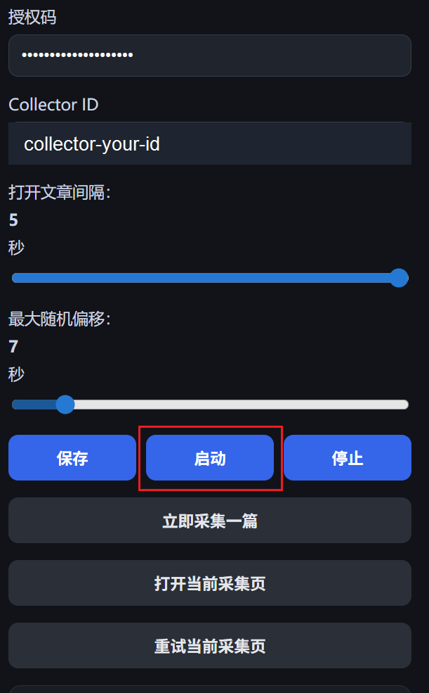
6. 等待采集完成后，再回到“知识问答”提问。

说明：

- 新增文章会默认进入索引流程。
- 如果文章没有正文，知识问答只能参考标题、来源和链接，回答质量会下降。
- 完成正文采集后，系统会使用更完整的文章内容参与知识问答。

### 5. 知识问答
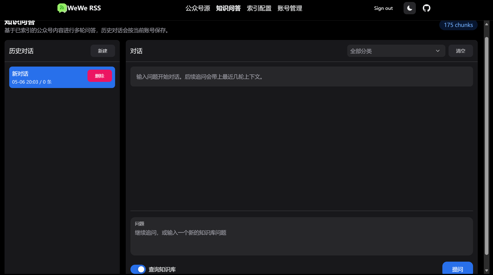
“知识问答”用于根据已索引文章进行提问，使用上类似于ChatGPT或者DeepSeek的网页端对话,目前使用的大模型是Minimax-m2.7。

基础使用：

1. 进入“知识问答”。
2. 选择是否开启“查询知识库”。
3. 选择一个或多个分类，也可以不选分类表示全部分类。
4. 输入问题。
5. 点击“提问”。

“查询知识库”开关说明：

- 开启：系统会先检索你的文章知识库，再结合检索结果回答。
- 关闭：系统不检索文章，直接让大模型回答。

建议：

- 问公众号文章相关问题时，开启“查询知识库”。
- 问通用问题时，可以关闭“查询知识库”。
- 当知识库内容很多时，先筛选分类，可以让回答更聚焦。

历史对话：

- 对话会保存到系统中。
- 同一个账号再次登录后，可以继续查看历史对话。
- 不同账号之间的对话相互隔离。

引用来源：

- 回答下方会显示“引用来源”。
- 引用来源默认折叠，可以展开查看。
- 回答中的“资料1”“[1]”等标记可以点击，直接打开对应文章来源。

如果回答提示没有足够资料：

1. 检查是否开启了“查询知识库”。
2. 检查分类是否选得过窄。
3. 检查相关文章是否已经索引。
4. 检查文章是否已完成正文采集。

## 二、浏览器正文采集插件使用

浏览器插件用于采集微信公众号文章正文，并提交回系统。它需要在你的本机浏览器中运行。

插件不会绕过微信验证。如果微信要求验证，需要你手动完成。

### 1. 什么时候需要用插件
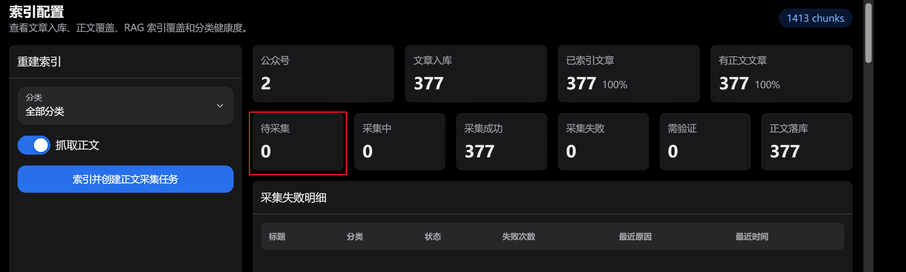
当“索引配置”中存在“待采集”文章时，需要启动浏览器插件。

插件会自动：

1. 从系统领取一篇待采集文章。
2. 在浏览器中打开微信公众号文章。
3. 提取文章标题、作者和正文。
4. 把正文提交回系统。
5. 继续处理下一篇文章。

### 2. 安装插件

Chrome 浏览器：

1. 打开 `chrome://extensions`。
2. 开启“开发者模式”。
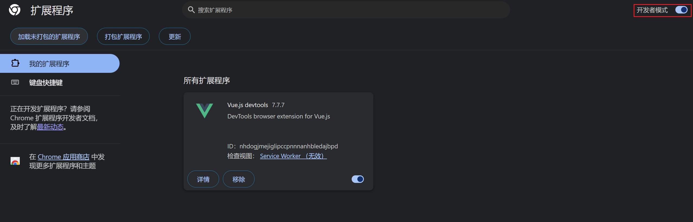
3. 点击“加载未打包的扩展程序”。
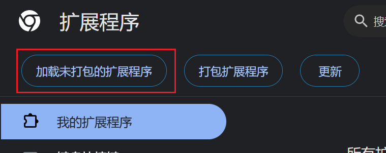
4. 选择插件目录。

Edge 浏览器：

1. 打开 `edge://extensions`。
2. 开启“开发人员模式”。
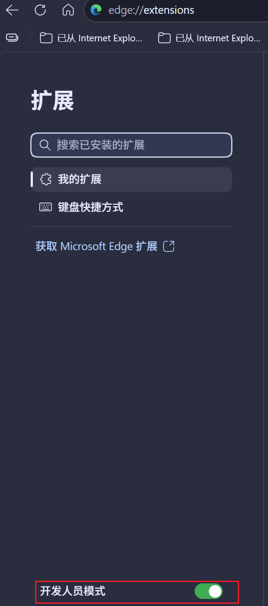
3. 点击“加载解压缩的扩展”。
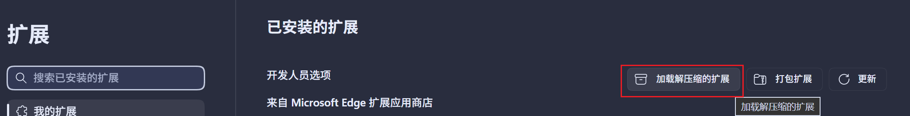
4. 选择插件目录。

插件安装完成后，浏览器工具栏会出现 WeWe RSS Collector 图标。

### 3. 配置插件

点击插件图标，填写配置。
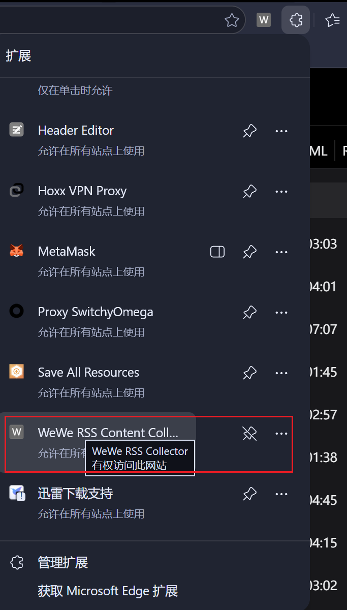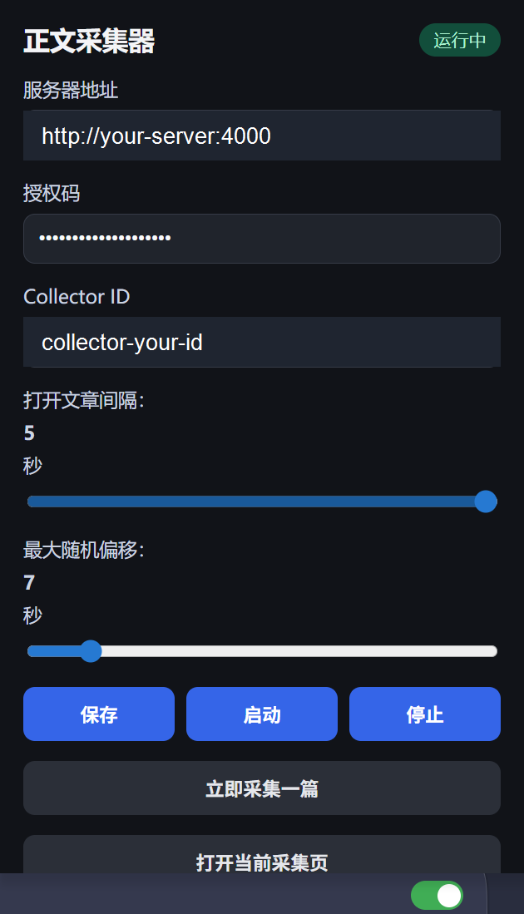
需要填写：

- 服务器地址：系统维护者提供的服务端地址，例如 `http://your-server:4000`
- 授权码：向系统维护者获取
- Collector ID：默认自动生成，一般不用修改
- 打开文章间隔：建议 3 秒
- 最大随机偏移：建议 10 到 30 秒

填写完成后点击“保存”。

注意：

- 服务器地址只填写根地址，不要填写 `/dash/knowledge` 这类页面地址。
- 授权码填错时，插件无法领取任务。
- 间隔不要设置过低，否则更容易触发微信验证。

### 4. 启动采集

启动前先确认：

1. 服务端“索引配置”中有待采集任务。
2. 当前浏览器可以正常打开微信公众号文章。
3. 插件已经填写服务器地址和授权码。

启动方式：

1. 点击浏览器插件图标。
2. 点击“启动”。
3. 插件会开始自动采集。

如果只想测试一篇，可以点击“立即采集一篇”。

### 5. 查看采集状态

插件弹窗中会显示当前状态。
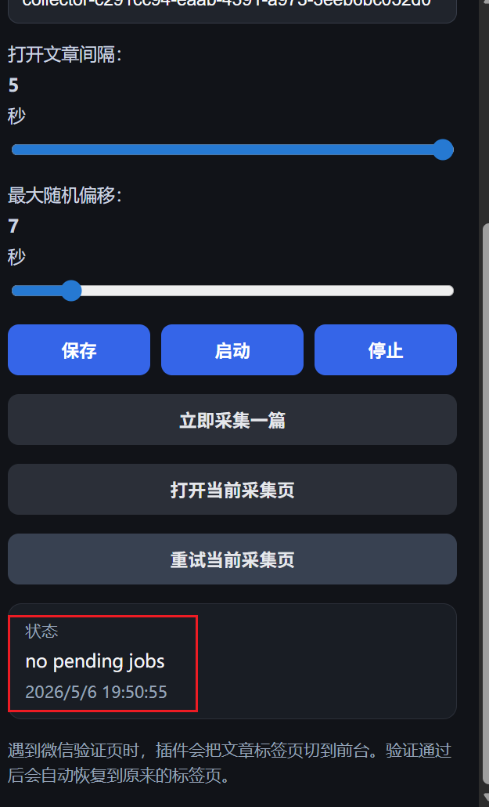
常见状态：

- 未启动：插件没有运行。
- 运行中：插件正在后台等待或处理任务。
- 正在采集：插件已经打开文章并尝试提取正文。
- no pending job：当前没有待采集任务。
- verify required：遇到微信验证，需要人工处理。
- failed：采集失败。
- empty：页面没有提取到有效正文。

服务端“索引配置”页面也可以查看整体任务状态，包括待采集、采集中、采集成功、采集失败和需验证。

### 6. 处理微信验证

如果插件遇到微信验证页：

1. 插件会把文章页面切到前台。
2. 按微信页面提示手动完成验证。
3. 验证完成后，点击插件中的“重试当前采集页”。
4. 如果文章正文正常显示，插件会重新提交正文。

如果一直触发验证：

- 先暂停插件。
- 等一段时间再继续。
- 调大采集间隔和随机偏移。
- 避免多个浏览器同时高频采集。

### 7. 停止采集

点击插件中的“停止”即可。

停止后，插件不会继续领取新任务。已经失败或未完成的任务，后续可以重新创建或等待系统释放后再次采集。

### 8. 常见问题

#### 插件提示 server URL is required

没有填写服务器地址。填写：

```text
http://your-server:4000
```

#### 插件提示 auth code is required

没有填写授权码。向系统维护者获取授权码后填写。

#### 插件无法领取任务

检查：

- 服务端是否有待采集任务。
- 服务器地址是否正确。
- 授权码是否正确。
- 当前浏览器网络是否能访问服务端。

#### 采集后知识问答还是没有正文

可能原因：

- 文章采集失败。
- 文章遇到验证，尚未完成。
- 正文已采集，但索引还没有更新。

处理方式：

1. 在“索引配置”查看该批任务状态。
2. 对失败或需验证的任务重新处理。
3. 等待系统重新索引后再提问。
